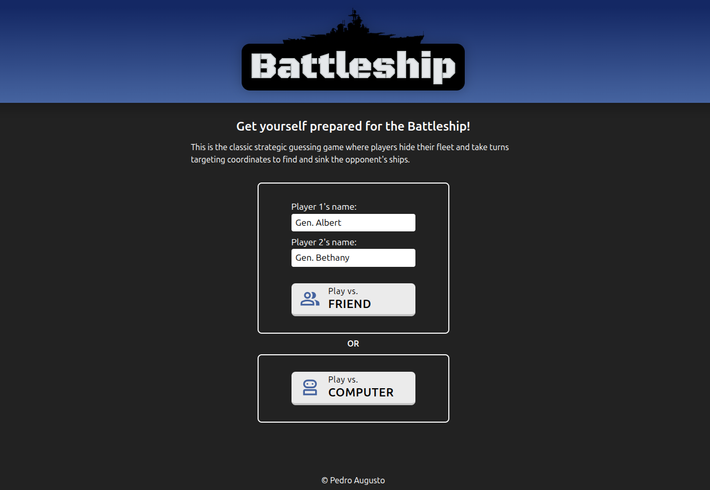
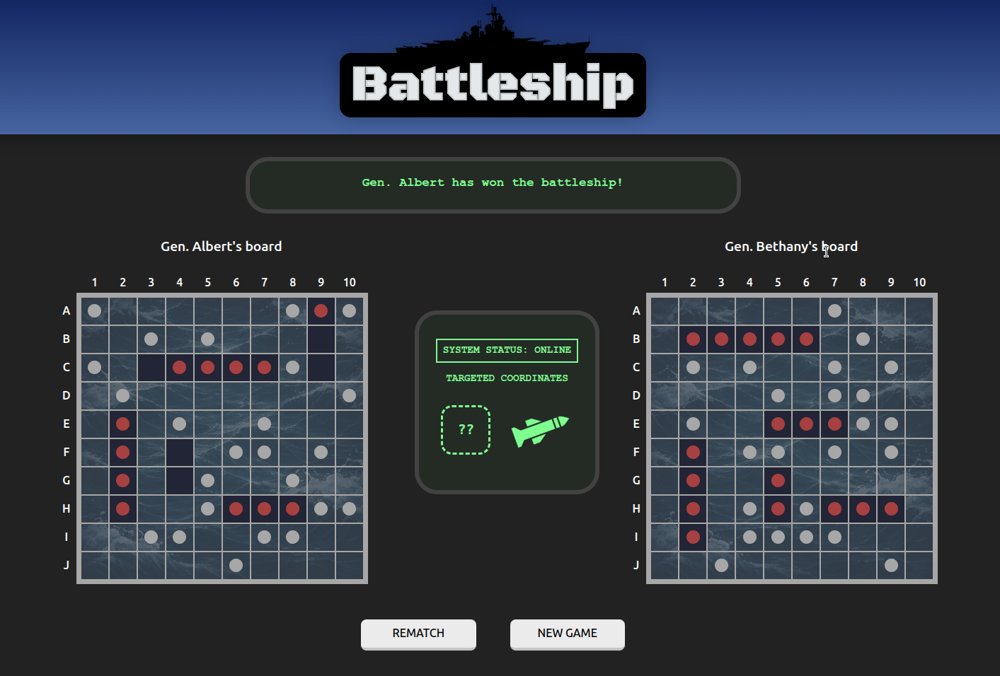
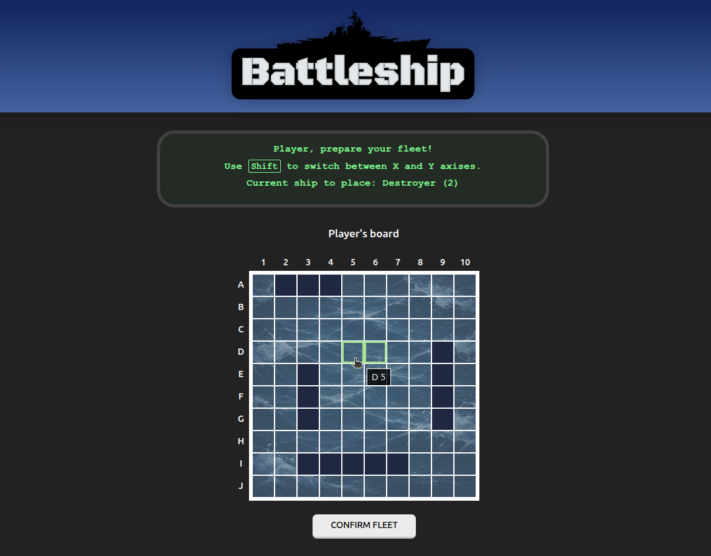
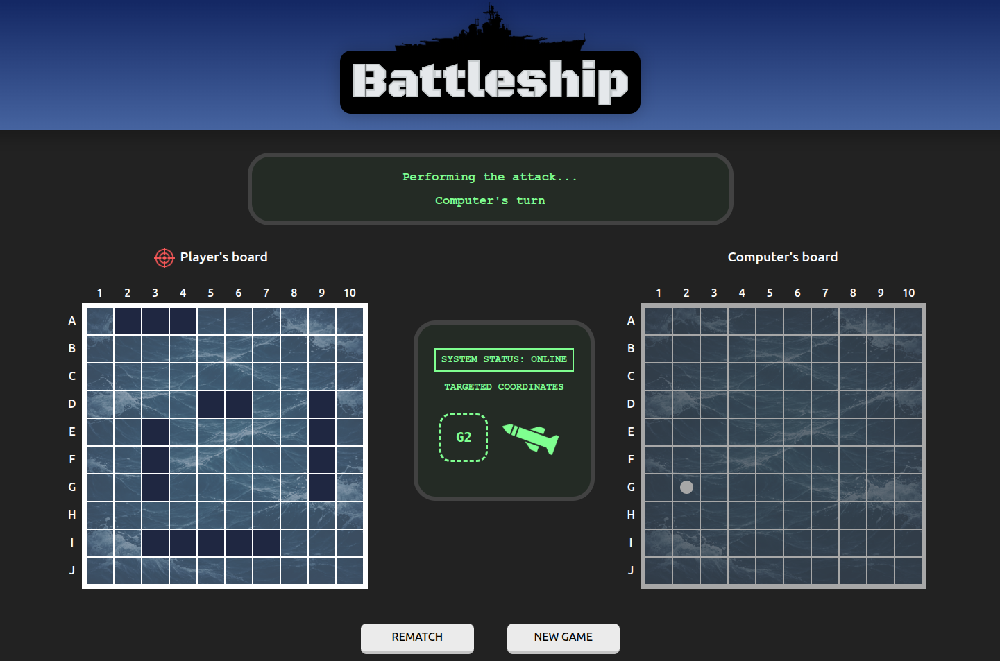

# Battleship

## Description

- This is a web version of the classic Battleship game. The user can play against the computer or against another player locally.
- **Main features:**
  - Test driven development for gameboard and ship modules (Jest framework)
  - Game controller module (manage game's state)
  - DOM manager module (create/edit/delete DOM elements)
  - Webpack module bundler

## Live Demo

**[Click here](https://pedroasb.github.io/battleship/)** to try out this project on browser.

## Screenshots

## About the Project

This project is part of the curriculum of [The Odin Project](https://www.theodinproject.com/). You can check out other projects that I've built in my [fullstack-journey](https://github.com/PedroASB/fullstack-journey) repository.

## Attributions

- **Fonts**
  - Black Ops One — available on [Google Fonts](https://fonts.google.com/) under the under the SIL Open Font License, Version 1.1.
- **Icons & Images**
  - <a href="https://www.flaticon.com/free-icons/target" title="target icons">Target icons created by Freepik - Flaticon</a>
  - <a href="https://www.flaticon.com/free-icons/missile" title="missile icons">Missile icons created by ranksol graphics - Flaticon</a>
